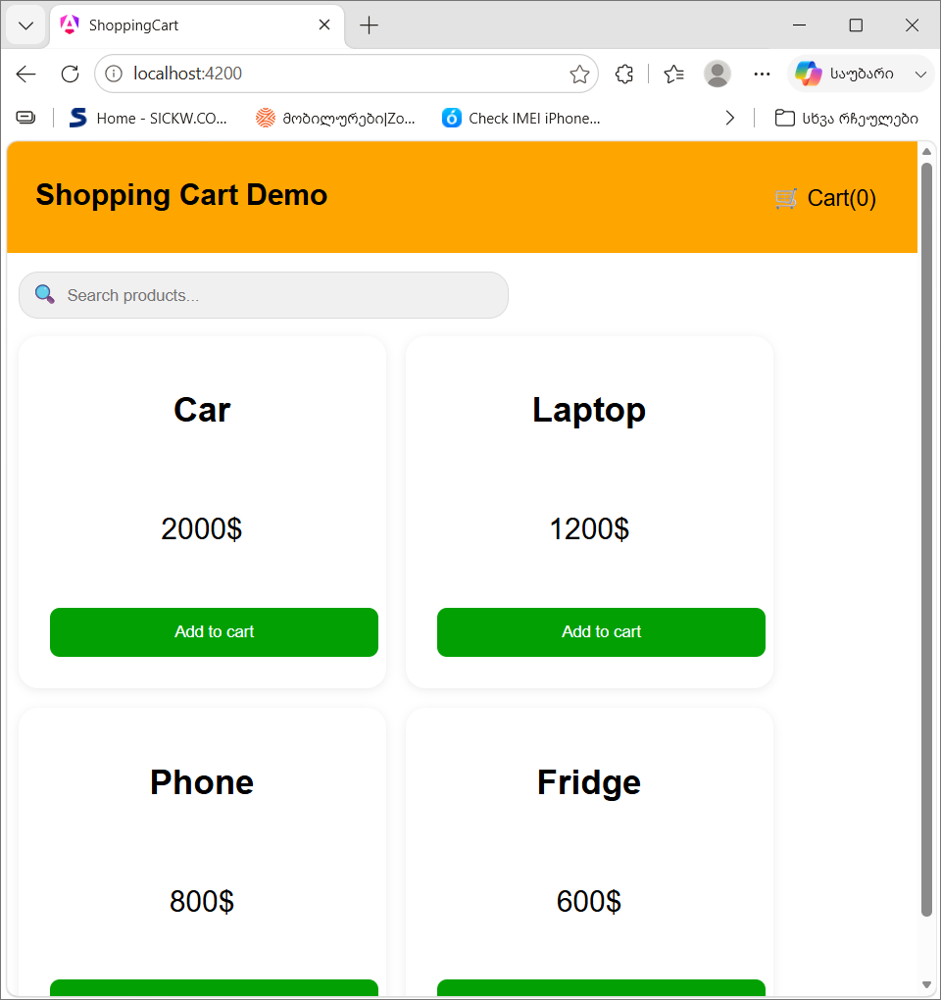
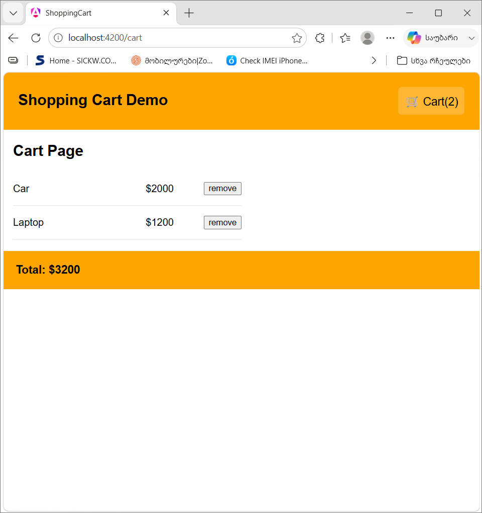

# ShoppingCart

A simple Shopping Cart application built with Angular to practice component communication, state management with RxJS(BehaviorSubject for reactive cart state management) and building responsive user interfaces.

## Features

- Display a list of products
- Search products in real time
- Add product to the shopping cart
- Display the current cart item count in the header
- Automatically update the cart using RxJS BehaviorSubject
- Calculate the total price of all items in the cart
- Remove products from cart

## Technologies

- Angular 21
- TypeScript
- HTML5
- CSS3
- RxJS
- BehaviorSubject

## What I Learned

During this project I practiced:

- Building an angular application using standalone components
- Creating reusable components
- Managing application state with RxJS(BehaviorSubject)
- Sharing data between components through services
- Implementing search and filtering functionality
- Managing shopping cart state
- Updating UI reactively based on state changes
- Organizing an Angular project into components, services and models
- Writing clean, maintainable code

# Project Structure

- *Header* - displays the application title and the current number of products in the cart
- *Search Bar* - filters products by name
- *Products List* - displays all available products
- *Product Card* - shows product information and "Add to Cart" button
- *Cart* - displays selected products and the total price

## Future improvements

- Save the cart between sessions (Local Storage)
- Fetch products from an API
- Product categories
- Sorting
- Product details page
- Authentication
- Chackout flow
- Wishlist
- Unit and E2E tests
- Better accessibility
- Performance optimizations

## Prerequisites

Before running this project, make sure you have installed:

- Node.js (v22 or later)
- npm (comes with Node.js)
- Angular CLI (`npm install -g @angular/cli`)
- Git (optional, for cloning the repository)

### Installation

Clone the repository:

git clone https://github.com/teo00000/shopping-cart

cd shopping-cart

Install dependencies:

```bash
npm install
```

Run the application: 

```bash
ng serve
```

Open your browser and navigate to:

```
http://localhost:4200/
```
## Build

```bash
ng build
```

## Screenshots

### Home Page



### Shopping Cart



## Author

Created by **Teona Papiashvili**

- Github: http://github.com/teo00000

